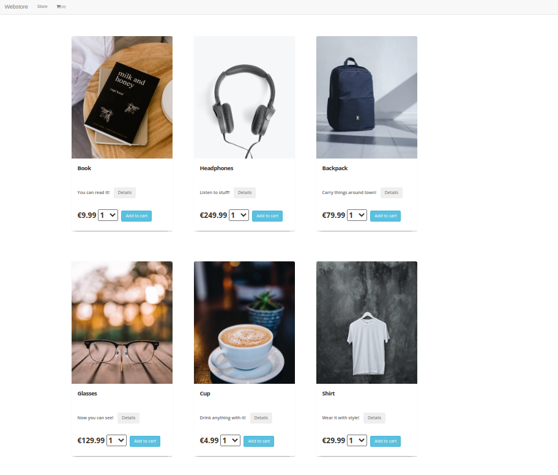
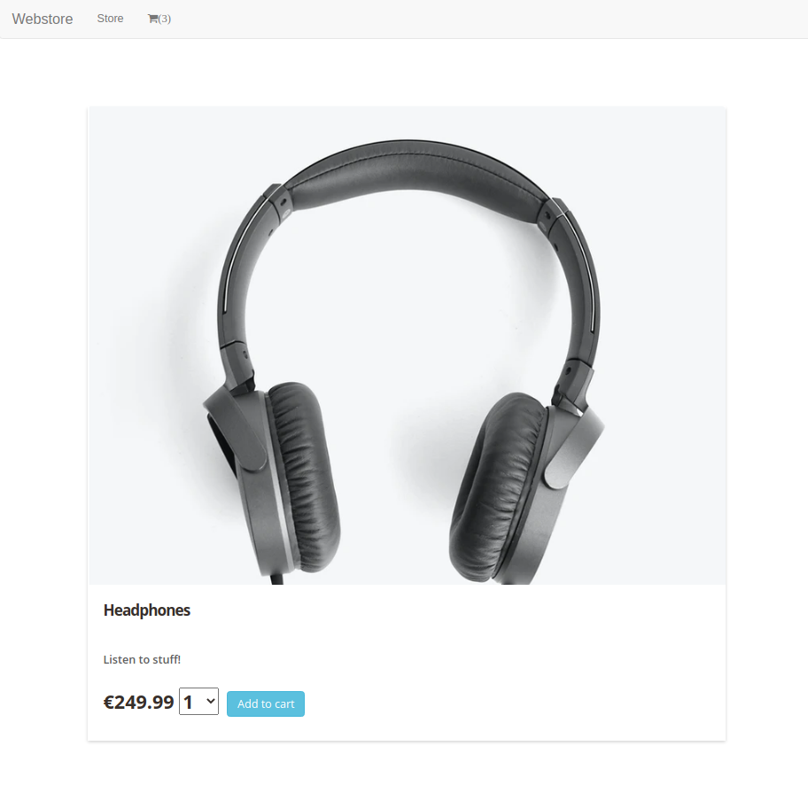
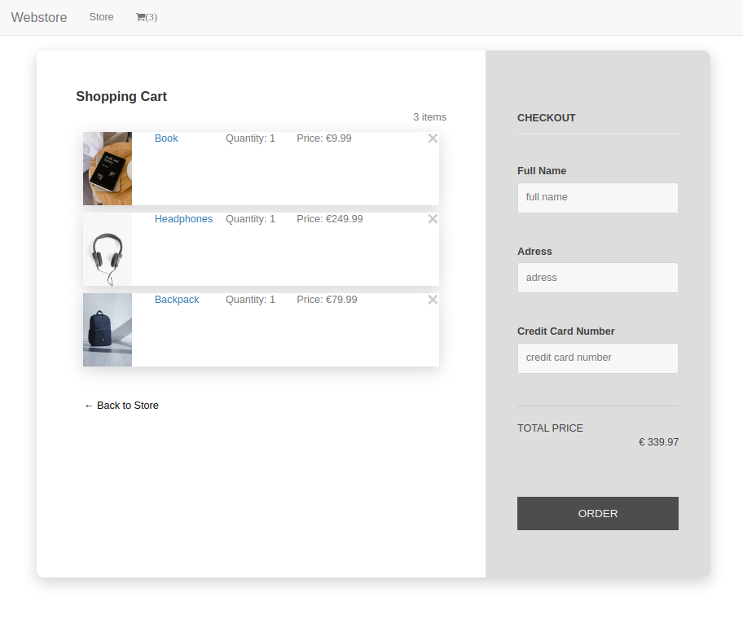

# AngularWebstoreFrontend

This project was generated with [Angular CLI](https://github.com/angular/angular-cli) version 12.2.2.

## Installation
Install NodeJs

```
# select version and system to install
VERSION=v12.14.0
DISTRO=linux-x64
# declare install destination
dst_dir="/usr/local/lib/nodejs"
sudo mkdir -p "${dst_dir}"
# download and extract
wget -c https://nodejs.org/download/release/${VERSION}/node-${VERSION}-${DISTRO}.tar.xz -O - | sudo tar -xJ -C "${dst_dir}"
# add to path / maybe also add it to your .bashrc
export PATH="/usr/local/lib/nodejs/node-${VERSION}-${DISTRO}/bin:${PATH}"

Install Angular CLI
```
npm install -g @angular/cli@latest
```

## Development server

Run `ng serve` for a dev server. Navigate to `http://localhost:4200/`. The app will automatically reload if you change any of the source files.

## Code scaffolding

Run `ng generate component component-name` to generate a new component. You can also use `ng generate directive|pipe|service|class|guard|interface|enum|module`.

## Build

Run `ng build` to build the project. The build artifacts will be stored in the `dist/` directory.

## Running unit tests

Run `ng test` to execute the unit tests via [Karma](https://karma-runner.github.io).

# Overview
## Products List

## Product Details Page

## Cart and Checkout
